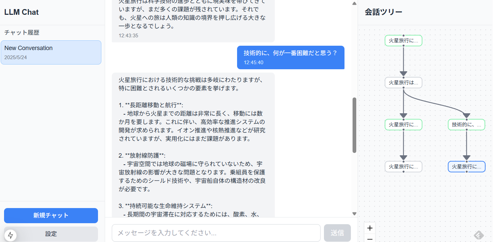

# LLM Chat Application with Branching Conversation

This is a chat application that allows you to have conversations with LLMs (Language Model Models) and branch off from previous turns (nodes) in the conversation. Unlike typical chat applications, you can go back to a previous point in the conversation and start a new flow from there.



## Features

* **Branching Conversations**: Create new conversation branches from any previous turn.
* **Multiple LLM Provider Support**: Supports OpenAI, Azure, Gemini, Claude, and Ollama.
* **Visual Conversation Tree**: A tree view of the conversation history, allowing you to easily navigate and branch off.
* **Easy Configuration**: Configure API keys and URLs for different LLM providers through the settings screen.

## Installation

1. Clone the repository:

    ```bash
    git clone <repository_url>
    cd llm-node-chat
    npm install
    ```

2. Install backend dependencies:

    ```bash
    cd backend
    uv venv
    source .venv/bin/activate
    uv sync
    cd ..
    ```

3. Install frontend dependencies:

    ```bash
    cd frontend
    npm install
    cd ..
    ```

4. Set up the environment:

    * Configure the environment variables in `backend/.env`.  You can copy `.env.example` to `.env` and modify it.

## Configuration

1. **API Keys**:
    * You need API keys for the LLM providers you want to use (OpenAI, Gemini, Claude, etc.).
    * Enter the API keys in the settings screen of the application.

2. **Ollama**:
    * If you want to use Ollama, make sure you have it installed and running.
    * You can specify the Ollama base URL in the settings screen.

## Running the Application

1. Start servers

    ```bash
    npm run dev
    ```

2. Open the application in your browser at `http://localhost:3000`.

## Using the Application

1. **Start a New Chat**:
    * Click the "New Chat" button in the sidebar.

2. **Send Messages**:
    * Type your message in the text input box and press Enter.

3. **Branch Conversations**:
    * Select a node in the conversation tree to go back to that point in the conversation.
    * Type your message in the text input box and press Enter to create a new branch.

4. **Configure LLM Providers**:
    * Click the "Settings" button in the sidebar.
    * Enter the API keys and URLs for the LLM providers you want to use.
    * Select the active provider.

## Contributing

Contributions are welcome! Please feel free to submit pull requests.

## License

[MIT](LICENSE)
